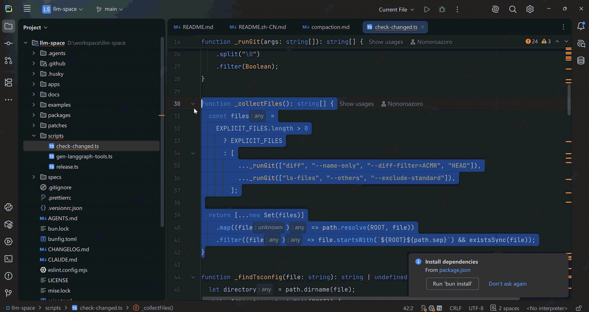

# WhatIsThis

> 选中任何东西，一键发问，瞬间告诉你"这是干嘛的"。
> Select anything, press one shortcut, get an instant answer about what it is.

[](https://github.com/404meters-ha/whatisthis/actions/workflows/build.yml)
[](LICENSE)
[](https://plugins.jetbrains.com/docs/intellij/build-number-ranges.html)



**WhatIsThis** 是一个 IntelliJ 平台插件（全家桶通用：IDEA / PyCharm / WebStorm / GoLand / CLion …），让你对**截图、选中代码、文件**一键提问，AI 流式秒回"这是干嘛用的"。

## ✨ 特性 / Features

| 输入 | 入口 | AI 回答 |
| --- | --- | --- |
| 📸 截图（剪贴板） | `Ctrl+Alt+W` / `Cmd+Alt+W` | 这是什么按钮/控件/代码/报错，用途与场景 |
| 💻 选中的代码 | 快捷键 或 编辑器右键 → *What Is This?* | 功能、语法糖、结合 imports 轻度推断项目角色 |
| 📄 文件 | 编辑器/Project View 右键 → *What Is This?* | 这个文件是干嘛的（截断至 500 行） |
| 📋 剪贴板文本 | 快捷键 | 同代码 |

- ⚡ **为速度而生**：一次调用同时完成"分类 + 回答"，SSE 流式输出，回答限长（≤200 字要点），零第三方运行时依赖
- 💬 **追问**：popup 底部输入框直接追问（Enter 发送，Shift+Enter 换行），Esc 关闭即弃
- 🔑 **自带 Key**：DeepSeek / 豆包·火山方舟 / 智谱 GLM / Kimi / 阿里百炼 Qwen / OpenAI / 任意 OpenAI 兼容端点，Key 存于 IDE PasswordSafe 加密存储
- 🖼️ **视觉模型守护**：所选模型可能不支持图片时提前提醒，可"仍然发送"

## 📦 安装 / Install

**从 GitHub Releases 安装（推荐）**：到 [Releases](https://github.com/404meters-ha/whatisthis/releases) 下载最新 `whatisthis-1.0.0.zip`，然后 `Settings → Plugins → ⚙️ → Install Plugin from Disk...` 选择 zip，重启 IDE。

> JetBrains Marketplace 上架筹备中。/ Pending review on JetBrains Marketplace.

兼容 IntelliJ Platform **2024.3+** 全家桶（IDEA / PyCharm / WebStorm / GoLand / CLion / DataGrip / RustRover …）。

## 🚀 快速开始

1. **Settings → Tools → WhatIsThis**（或第一次按快捷键时会引导你去设置页）
2. 选择服务商（默认 DeepSeek），点击"获取 API Key"注册并创建 Key
3. 粘贴 API Key → **测试连接** → OK
4. 截一张图（Win+Shift+S / 微信截图等），回到 IDE 按 `Ctrl+Alt+W`

### 各服务商默认模型

| 服务商 | 默认模型 | 支持截图 |
| --- | --- | --- |
| DeepSeek | `deepseek-v4-flash-vision-exp` | ✅ |
| 豆包 · 火山方舟 | `doubao-seed-1-6-vision-250815` | ✅ |
| 智谱 GLM | `glm-4.5v` | ✅ |
| Kimi | `moonshot-v1-8k-vision-preview` | ✅ |
| 阿里百炼 Qwen | `qwen-vl-max` | ✅ |
| OpenAI | `gpt-4o-mini` | ✅ |

模型名在设置页可随时修改（服务商发布新模型后，直接填新模型名即可；未在已知视觉列表中的自定义模型，发截图前会先提醒）。

## 🔒 隐私 / Privacy

你问什么、截什么，就发送什么——**仅发送到你自己在设置页配置的大模型服务商**。插件本身无服务器、无统计、无遥测。API Key 存储在 IDE 的 PasswordSafe 中，不落明文。

## 🛠️ 从源码构建

```bash
./gradlew buildPlugin        # 产物在 build/distributions/
./gradlew verifyPlugin       # 跨版本兼容性校验（2024.3 → 2025.3）
./gradlew runIde             # 起一个沙箱 IDE 试用
```

- 兼容：IntelliJ Platform 2024.3+（since-build 243，无 until 上限）
- 技术栈：Kotlin + JDK HttpClient（SSE 手写解析）+ kotlinx.serialization

### 发布（维护者）

打 tag `v*` 会触发 GitHub Actions：构建并校验 → 附 zip 产物创建 GitHub Release → （若配置了 `JETBRAINS_TOKEN`）发布到 JetBrains Marketplace。

## License

[MIT](LICENSE)
